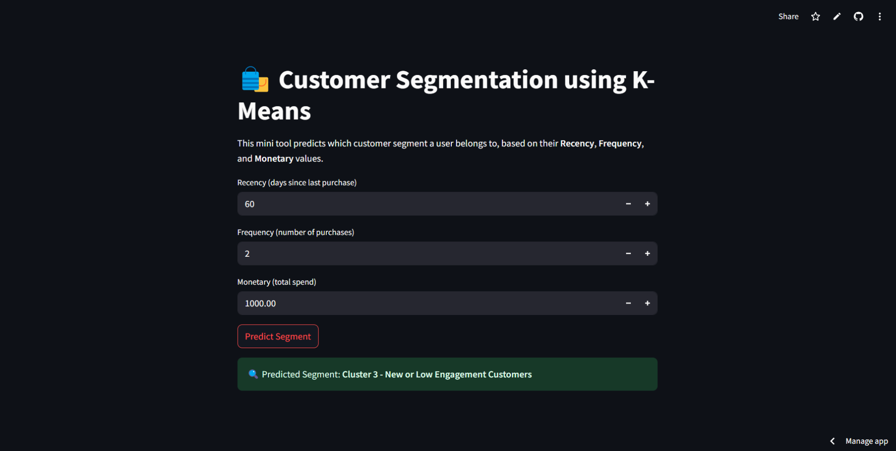

# Customer Segmentation Tool

This is a **Customer Segmentation Tool** built using **KMeans clustering** for classifying customers into segments based on their **Recency**, **Frequency**, and **Monetary** values (RFM). The tool is built using **Streamlit** and is designed to classify customers of an e-commerce company based on their purchasing behavior.

## Overview

Customer segmentation is a crucial aspect of personalized marketing and customer relationship management. By using **KMeans clustering**, this tool divides customers into different segments such as:

- **Loyal Customers**
- **Churned/Inactive Customers**
- **High-Value Customers**
- **New or Low Engagement Customers**

These segments are based on the customers' **RFM (Recency, Frequency, and Monetary)** values, which are derived from their transaction data.

## Features

- **User Input**: The user enters their **RFM** valuesto check which segment they belong to.
- **Segmentation**: The app uses **KMeans clustering** to categorize customers into different segments based on their purchasing behavior.
- **Results**: The app displays the customer's segment (e.g., **Loyal Customers**, **High-Value Customers**).

## Tech Stack

- **Python**
- **Streamlit** (for the web interface)
- **pandas** (for data manipulation)
- **scikit-learn** (for machine learning)

## Output Screenshots

